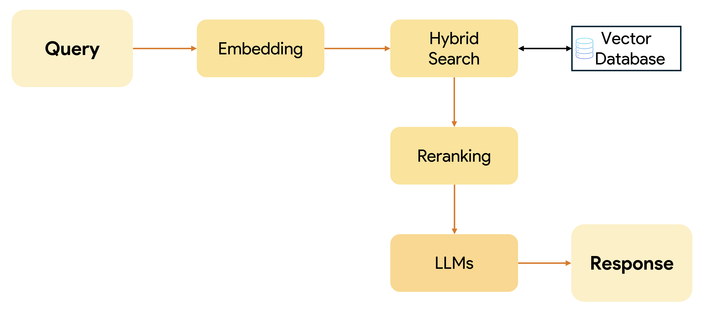

# RAG QA ASSIGNMENT 2


## Cài đặt

1.  **Clone Repo:**
    ```bash
    git clone https://github.com/qxuanson/rag-qa/
    cd rag-qa
    ```

2.  **API Key:**
    Tạo một tệp `.env` trong thư mục gốc của dự án.
    ```env
    GOOGLE_API_KEY="YOUR_GOOGLE_API_KEY"
    HUGGINGFACE_API_KEY="YOUR_HUGGINGFACE_API_KEY"
    NEBIUS_API_KEY="YOUR_NEBIUS_API_KEY"
    ```

3.  **Chạy Ứng dụng:**
    ```bash
    rag.ipynb 
    ```
